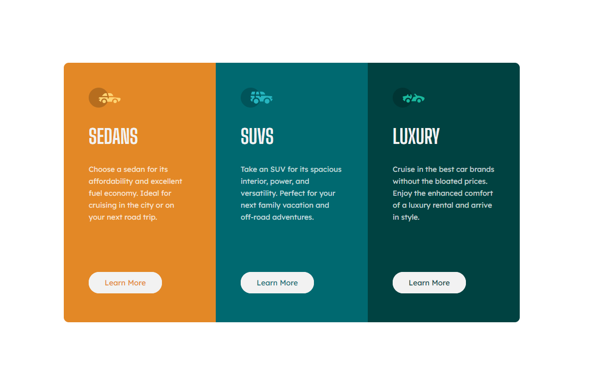

# Frontend Mentor - 3-column preview card component solution

This is a solution to the [3-column preview card component challenge on Frontend Mentor](https://www.frontendmentor.io/challenges/3column-preview-card-component-pH92eAR2-). Frontend Mentor challenges help you improve your coding skills by building realistic projects. 

## Table of contents
 - [The challenge](#the-challenge)
 - [Screenshot](#screenshot)
 - [Links](#links)
 - [Built with](#built-with)

## The challenge

Users should be able to:

- View the optimal layout depending on their device's screen size
- See hover states for interactive elements

## Screenshot

 

## Links
Live Site URL: [karolnowinski/3-column-preview-card-component](https://karolnowinski/3-column-preview-card-component)

## Built with

- Flexbox
- BEM methodology
- CSS custom properties